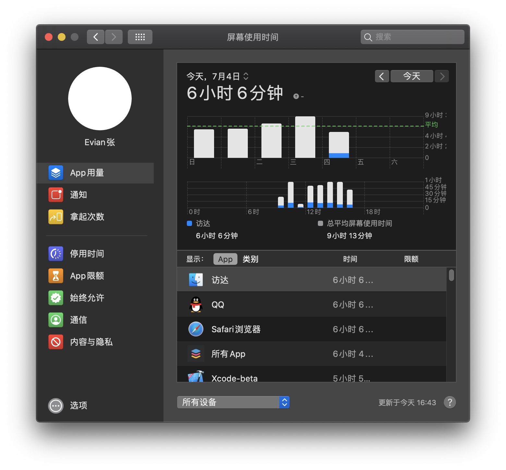

#  ScreenTimeController — 查询、修改 macOS 10.15 的「屏幕使用时间」数据

## 下载地址

[Evian-Zhang/ScreenTimeController v1.0](https://github.com/Evian-Zhang/ScreenTimeController/releases/download/v1.0/ScreenTimeController.dmg)

当前版本 v1.0

更新时间 2019.7.4

## 简介

在 macOS 10.15 Catalina 中，Apple 将之前在 iOS 中率先推出的「屏幕使用时间」应用移植到了 macOS 上，使用效果如图。

而该应用则有一些瑕疵：

* 无法按月份、年份来查看
* 无法自定义查看日期
* 无法管理数据（删除、修改等）

我设计的「ScreenTimeController」则弥补了这些瑕疵。它通过访问「屏幕使用时间」存储在本地的数据库进行查看、修改。

## 使用截图

## 使用方法

### 查询

查询可按「应用名称」、「Bundle ID」和「域名」进行搜索，这里推荐使用「Bundle ID」和「域名」。所谓 Bundle ID, 就是应用的唯一标识符，获得方法可以去相关搜索引擎上进行搜索；「域名」则是指在「屏幕使用时间」中显示的，在浏览器中浏览某域名时对应的时间。

### 修改和删除

当查询成功后，可在对应表格中双击对应的数据进行修改；右键点击相应的数据进行删除。

## 注意事项

* 暂时仅支持修改当前设备的屏幕使用时间（即假设当前设备的名称为「xxx的 MacBook Pro」, 那么修改或删除后的数据，在系统偏好设置的「屏幕使用时间」中，仅能通过选择「xxx的 MacBook Pro」来查看，而不能选择「所有设备」来查看）
* 暂时不支持多用户查看
* 请尽量避免修改或删除对应于此时此刻的数据，有可能会修改或删除无效
* 暂时不支持查看「所有 App」的相应数据，只能查看单独某个特定的 App 的数据

## 原理

### 获得数据库位置

首先使用`getconf DARWIN_USER_DIR`获得用户的`private`目录，在终端下输入后，输出结果会是`/var/folders/zx/xxxxxxxxxx/0/`, 其中xxxxx是每个用户都不同的标识符。关于`0`目录的说明，可以看[What-is-var-folders](http://www.magnusviri.com/OS_X_Admin/what-is-var-folders.html).

进入了用户目录后，找到`com.apple.ScreenTimeAgent`目录。这里顺便提一句，由此也可以看出，「屏幕使用时间」是利用一个在后台运行的 LaunchAgent 进行实时记录的，其 plist 大致位于`~/Library/Containers/com.apple.ScreenTimeAgent/Container.plist`. 关于利用 LaunchAgent 来在开机时启动程序，可以看我之前的文章[设计macOS上登录自启动的菜单栏的后台非沙盒应用](https://Evian-Zhang.github.io/articles/macOS/设计macOS上登录自启动的菜单栏的后台非沙盒应用/67788332.html)。

在进入到`com.apple.ScreenTimeAgent`目录后，进入其`Store`子目录，可以看到几个`.sqlite`结尾的文件（`.sqlite-wal`和`.sqlite-shm`都是 Core Data 的辅助性数据库，其作用是起到一个缓存作用）：`RMAdminStore-Cloud.sqlite`和`RMAdminStore-Local.sqlite`, 正如其名字所示，前者负责云端同步，后者负责本地存储。因此，我们主要需要连接的是`RMAdminStore-Local.sqlite`.

### 分析数据库

整个数据库中有多张表格，每张表格之间都相互关联，关系错综复杂，我们主要只关注几个表格。

#### `ZUSERDEVICESTATE`

首先我们进入该表格，找到`ZLOCALDEVICE`字段为1(即`true`)的记录，记下其对应的`ZDEVICE`字段的值。（该表格还有一个`ZLOCALUSER`的字段，因为我并没有使用多用户模式，所以并不能判断这个字段的详细用途，因此目前该应用暂时不支持多用户模式）

#### `ZUSAGE`

进入该表格，在`ZDEVICE`字段中寻找符合刚才我们找到的本地设备的编号，并记下该记录对应的`Z_PK`字段

#### `ZUSAGEBLOCK`

进入该表格，首先把所有`ZUSAGE`与之前记录下的`Z_PK`字段相同的记录都筛选出来，别的记录都是同步在本地的其他设备的记录。接着，我们只关心每条记录的`Z_PK`字段和`ZSTARTDATE`字段。这里的`ZSTARTDATE`字段的值，是将`startDate`的`timeIntervalSinceReferenceDate`的属性进行存储。

#### `ZUSAGECATEGORY`

进入该表格，每条记录都对应一个`ZUSAGEBLOCK`表格的记录，因此，对于每条记录，记下其`Z_PK`, `ZBLOCK`的值。

#### `ZINSTALLEDAPP`

该表格记录的是每个 Bundle ID 对应的应用程序的`displayName`. 在使用「利用应用名称查找」功能时会用到。

#### `ZUSAGECOUNTEDITEM`

该表格记录的是「通知」和「拿起次数」，每条记录对应一个 `ZBLOCK`, 因此，对于给定的起止时间和 Bundle ID, 就可以先在`ZUSAGEBLOCK`表格中找到在该时间段内的记录。然后再在`ZUSAGECOUNTEDITEM`表格中找到`ZBLOCK`字段属于那些记录，并且`ZBUNDLEIDENTIFIER`字段等于 Bundle ID 的记录。

#### `ZUSAGETIMEDITEM`

该表格记录的是屏幕使用时间，与`ZUSAGECOUNTEDITEM`表格极其相似，只不过每一个记录对应一个`ZUSAGECATEGORY`的记录，因此还需要再多一步查找。

## Bug 反馈

请将使用中遇到的 bug 或者建议发送至邮箱evianzhang1999@gmail.com.

## 捐赠

我是一名默默无闻的本科生，利用闲暇时光进行这些开发。如果您支持我的工作，希望不吝捐赠！

